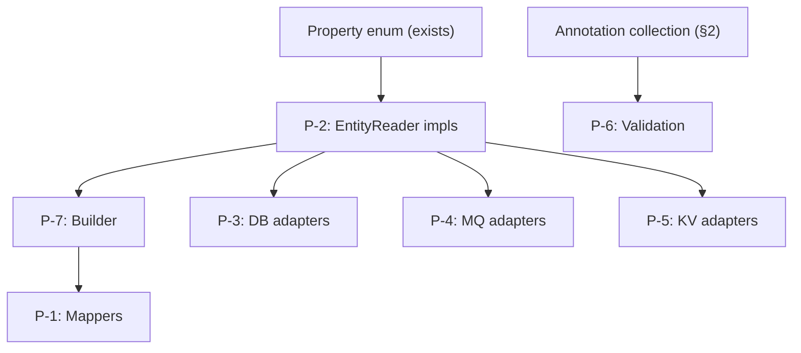

# Boilerplate Generation Proposals

These proposals build on a metadata-first foundation.
The primary value of `hipster-entity` is the generated metadata and stable interface contracts that enable other tools.
Concrete runtime helpers discussed here are optional building blocks; consumers may use the metadata directly without adopting every helper module.

For a deeper rationale on why the project avoids annotation processing as its primary model and prefers generated metadata/materialized code over reflection, see [Annotation processing vs generated metadata and materialized code](annotation-processing-vs-generated-metadata.md).

## 1. Type Mapping & Divergence Validation

### 1.1 What the metadata already provides

The current generator produces enough information to drive type mapping analysis at code-generation time, without touching the runtime classpath.

| Metadata element | Location | What it enables |
|------------------|----------|-----------------|
| `EntityFieldMeta.type` | `allFields[].type` | Primary (non-derived-preferred) type for each field across all views |
| `EntityFieldMeta.typeByView` | `allFields[].typeByView` | Exact type each view declares — the source-of-truth for per-view converters |
| `EntityFieldMeta.hasTypeDivergence()` | Java model | Quick predicate to filter only fields that *need* conversion |
| `EntityFieldMeta.fieldKind` | `allFields[].fieldKind` | Distinguishes COLUMN / DERIVED / JOINED — determines when a converter is needed vs when a field can be skipped |
| `TypeDescriptor` (parsed) | internal to generator | Full generic tree (e.g. `Map<String, List<Long>>`) for deep type comparison and nested converter lookup |
| `Property.type` per view | `views[].properties[].type` | Original declared type exactly as the developer wrote it |
| Primitive metadata | `type` / `unboxed` / `primitive` | Correct boxing/unboxing decisions for converters |

### 1.2 Type converter registry — deriving required converters

For every field where `hasTypeDivergence()` returns true, the generator can enumerate the set of required `(sourceType, targetType)` converter pairs by iterating `typeByView` entries.

**Example:**

```
allFields: [
  {
    "name": "age",
    "type": "java.lang.Integer",
    "typeByView": {
      "PersonSummary": "Integer",
      "PersonDto": "String"
    }
  }
]
```

Required converter pairs for a mapper from `PersonSummary` → `PersonDto`:
- `Integer → String`

For the reverse direction (`PersonDto` → `PersonSummary`):
- `String → Integer`

The generator can produce a **converter manifest** — either as JSON or as a generated Java interface:

```java
// Generated by metadata generator
public interface PersonConverters {
    String convertAge_IntegerToString(Integer value);
    Integer convertAge_StringToInteger(String value);
}
```

Or, a more generic registration approach:

```java
// Generated: required converter check
public final class PersonTypeConverters {
    private static final List<ConverterRequirement> REQUIRED = List.of(
        new ConverterRequirement("age", Integer.class, String.class, "PersonSummary", "PersonDto")
    );

    public static List<ConverterRequirement> required() { return REQUIRED; }
}
```

### 1.3 Validation: ensuring converter coverage

At code-generation time (or as a Maven plugin validation step), the generator can:

1. **Enumerate all divergent fields** — iterate `allFields` where `hasTypeDivergence()` is true.
2. **Compute required converter pairs** — for each pair of views in `typeByView`, extract `(viewA.type, viewB.type)` if they differ.
3. **Check a converter registry** — the developer supplies a configuration (annotation, SPI, or simple class implementing a known interface) that declares available converters.
4. **Emit diagnostics**:
   - **ERROR** — no converter found for a required pair.
   - **WARNING** — converter exists but field is DERIVED and the target view is write-only (converter may be dead code).
   - **INFO** — converter exists; all clear.

This approach catches conversion gaps **before** the application runs, during the build.

### 1.4 FieldKind-aware mapping strategies

Not all fields need converters the same way:

| FieldKind | Read → Read mapper | Read → Write mapper | Write → Read mapper | Notes |
|-----------|----|----|----|------|
| COLUMN | Copy or convert | Copy or convert | Copy or convert | Primary case for DB round-trip |
| DERIVED | Copy or convert | **Skip** (not stored) | N/A (cannot write) | Derived fields are computed; write views should not receive them |
| JOINED | Copy or convert | **Skip** (managed by relation) | N/A (relation managed) | Joined fields come from joins, not direct insert/update |

The generator already knows the `fieldKind` for every field. A mapper generator can use this to:
- Skip DERIVED/JOINED fields when generating write-direction mappers.
- Include DERIVED/JOINED fields in read-direction mappers (they are populated by queries).
- Flag an error if a write view declares a DERIVED field without explicit handling instructions.

### 1.5 Generic type conversion depth

`TypeDescriptor` decomposes generic types into a tree structure. This is needed for:

- `List<Long>` → `List<String>` — the converter must be applied to elements, not the list itself.
- `Map<String, Long>` → `Map<String, String>` — only the value type differs; converter applies to values.
- `Optional<Integer>` → `Optional<String>` — unwrap, convert, rewrap.

A converter code generator can walk the `TypeDescriptor` tree and emit structural conversion code:

```java
// Generated for List<Long> → List<String>
target.setTags(source.getTags().stream()
    .map(converters::longToString)
    .collect(Collectors.toList()));
```

### 1.6 Primitive safety

For fields where one view declares `int` and another declares `Integer`, the metadata flags both as `primitive: true` with the boxed class as the canonical type. The converter generator can:

- Detect `int` ↔ `Integer` as nullable-safety concern (not a type conversion).
- Emit null-checks for `Integer → int` direction (`Objects.requireNonNull` or default value).
- Avoid generating a converter for these cases — they are boxing, not conversion.

This is distinct from `Integer → String` which is a real type conversion.

---

## 2. Annotation Collection & Runtime Exposure

### 2.1 What JavaParser already collects

The generator already uses `MethodDeclaration.getAnnotationByName("FieldSource")` to extract `@FieldSource` attributes. JavaParser can collect **any** annotation on a method — user-defined or standard — via `method.getAnnotations()`, which returns all annotation expressions with their attribute key-value pairs.

### 2.2 What to collect

Extend the generator to collect, for each method:

| Data | Source |
|------|--------|
| Annotation fully-qualified name | `AnnotationExpr.getName()` + import resolution |
| Annotation attributes | Key-value pairs from `MemberValuePair` |
| Attribute types | String literal, enum reference, class literal, array, nested annotation |
| Position in annotation list | Ordering from source |

This would produce a model extension:

```java
public static class AnnotationMeta {
    public final String name;                      // e.g. "jakarta.validation.constraints.NotNull"
    public final Map<String, Object> attributes;   // e.g. {"message": "must not be null"}
}
```

And `Property` would gain:

```java
public final List<AnnotationMeta> annotations;     // all annotations on the method
```

### 2.3 Runtime exposure options

#### Option A: Extended property enum (recommended)

Add annotation metadata as fields on the existing `<View>Property` enum:

```java
public enum PersonSummaryProperty {
    id(java.lang.Long.class, List.of()),
    firstName(java.lang.String.class, List.of(
        new FieldAnnotation("NotNull", Map.of("message", "must not be null")),
        new FieldAnnotation("Size", Map.of("min", 1, "max", 100))
    )),
    age(java.lang.Integer.class, List.of(
        new FieldAnnotation("FieldSource", Map.of("kind", "DERIVED", "expression", "YEAR(NOW()) - YEAR(birthDate)"))
    ));

    private final Type propertyType;
    private final List<FieldAnnotation> annotations;

    PersonSummaryProperty(Type propertyType, List<FieldAnnotation> annotations) {
        this.propertyType = propertyType;
        this.annotations = annotations;
    }

    public Type getPropertyType() { return propertyType; }
    public List<FieldAnnotation> getAnnotations() { return annotations; }
    public boolean hasAnnotation(String name) {
        return annotations.stream().anyMatch(a -> a.name().equals(name));
    }
}
```

**Pros**: Single lookup point; enum constant already represents the field; no extra classes.
**Cons**: Enum constructor becomes verbose for heavily-annotated fields.

#### Option B: Companion metadata class

Generate a separate `<View>Meta` class with static methods:

```java
public final class PersonSummaryMeta {
    public static List<FieldAnnotation> annotationsFor(PersonSummaryProperty field) {
        return switch (field) {
            case firstName -> List.of(
                new FieldAnnotation("NotNull", Map.of()),
                new FieldAnnotation("Size", Map.of("min", 1, "max", 100))
            );
            case age -> List.of(
                new FieldAnnotation("FieldSource", Map.of("kind", "DERIVED"))
            );
            default -> List.of();
        };
    }
}
```

**Pros**: Keeps the enum clean; metadata class can grow independently.
**Cons**: Two generated files per view instead of one; lookup requires knowing both.

#### Option C: Annotation interface implementations

Generate implementations of the actual annotation interfaces:

```java
public final class PersonSummaryAnnotations {
    public static final FieldSource AGE_FIELD_SOURCE = new FieldSource() {
        public FieldKind kind() { return FieldKind.DERIVED; }
        public String expression() { return "YEAR(NOW()) - YEAR(birthDate)"; }
        public String column() { return ""; }
        public String relation() { return ""; }
        public Class<? extends java.lang.annotation.Annotation> annotationType() {
            return FieldSource.class;
        }
    };
}
```

**Pros**: Type-safe; works directly with code that expects annotation instances (e.g. validation frameworks).
**Cons**: Requires annotation classes on the classpath; more generated code; fragile when annotation APIs evolve; only works for annotations defined in the project or its dependencies.

#### Recommendation

**Option A** (extended enum) is the best starting point:
- Aligns with the existing `<View>Property` enum pattern.
- Single generated artifact per view.
- The `FieldAnnotation` record belongs in `hipster-entity-api` as a simple data carrier:

```java
// In hipster-entity-api
public record FieldAnnotation(String name, Map<String, Object> attributes) {}
```

Option B can be layered on later if annotation data becomes large enough to warrant separation. Option C is only justified when annotation instances must be passed to third-party frameworks (e.g., Bean Validation's `ConstraintValidator`).
---

## 3. Specialized DTO interface mapping for SQL/NoSQL reads and JSON short-circuit outputs

### 3.1 Use case: DTO interface as marker for direct read results

For high-throughput read scenarios (SQL or Mongo), we can avoid full entity materialization by using generated DTO interface models as a thin projection contract. The generator can emit interfaces for query projections and a minimal runtime adapter for JSON output, bypassing heavyweight entity beans or intermediate arrays.

Example DTO interface as read-projection marker:

```java
public interface PersonSummaryDTO {
    Long id();
    String displayName();
    Integer age();
}
```

Query side:
- SQL: `SELECT id, first_name AS displayName, age FROM person` into projection DTO
- Mongo: `collection.find(filter).projection(include("_id","displayName","age"))`

### 3.2 Raw JSON or JsonNode stream generation

Provide a generator-friendly pipeline:

1. Generate a `ResultProjection` descriptor for each DTO interface.
2. For each row/document, produce a compact map-like cursor: `Map<String,Object>` / `Object[]` per projection field.
3. Convert on-the-fly to JSON:
   - `JsonGenerator` (Jackson streaming) to avoid object graph retention
   - `JsonNodeFactory` for intermediate tree when `JsonNode` is needed

```java
public static void writeJson(PersonSummaryDTO source, JsonGenerator out) throws IOException {
    out.writeStartObject();
    out.writeNumberField("id", source.id());
    out.writeStringField("displayName", source.displayName());
    out.writeNumberField("age", source.age());
    out.writeEndObject();
}
```

Alternative short-circuit path using synthetic projections:
- `PersonSummaryDTO` + `Object[] values` array mapping by field order
- `JsonGenerator` can be fed from array index directly, no object allocation for DTO object

### 3.3 Performance & GC opportunity

- Memory pressure is reduced by avoiding full entity domain objects and collections; keep object lifetime to query row duration.
- Use primitive `long`, `int` boxing avoidance in projection path when possible.
- Streaming output via `JsonGenerator` or `Writer` keeps GC low compared to `List<Map>`/`List<DTO>`.
- `ThreadLocal<ByteArrayOutputStream>`/`ThreadLocal<JsonGenerator>` reuse reduces churn in high-frequency endpoints.
- For `JsonNode`, keep conversions lazy; avoid unnecessary `ObjectNode` creation when only raw text is needed.
- With Mongo, use driver projection + `Document` to data-binding only selected fields, minimizing document materialized bytes.

### 3.4 Ergonomics and developer experience

- Keep generator APIs simple: `ProjectedRecordMapper.create(PersonSummaryDTO.class)` and `mapper.forEach(row -> writer.write(row))`.
- Support both read-side interface references and generated builder-friendly record wrappers (`record PersonSummary(...)
`) for users who want strong typing.
- Enable annotations on DTO interfaces to guide projections from source field names and converters (e.g., `@FieldSource("first_name")`).
- Provide explicit fallback to full entity conversion for compatibility (when projection missing case expressions or computed fields).

### 3.5 Builder copy/merge pattern for projection materialization

For paths where no concrete entity instance exists (for example SQL/Mongo projection interfaces), generated builders should support direct ingestion from interface views.

Recommended pattern:
- `Builder(ViewType source)` constructor for one-shot materialization (main requirement).
- Constructor-based ingestion is the preferred path for ergonomics and performance.
- Optional `mergeFrom(ViewType source)` for update-via-view behavior.
- Optional `mergeFromIfNonNull(ViewType source)` variant for patch semantics.

Example:

```java
public final class PersonDtoBuilder {
    public PersonDtoBuilder(PersonSummary source) {
        this.id(source.id());
        this.firstName(source.firstName());
        this.lastName(source.lastName());
    }

    public PersonDtoBuilder mergeFrom(PersonUpdateView update) {
        return this
            .firstName(update.firstName())
            .lastName(update.lastName());
    }
}
```

This pattern gives a predictable bridge from read-only interface projections to materialized DTO/record outputs and supports partial update flows without forcing a mutable entity model.

Default recommendation: prefer constructor ingestion for full materialization and use merge only when patch/update semantics are explicitly needed.

### 3.6 Scope for separate detailed document

This section is a high-level blueprint; a dedicated design doc should cover:
- SQL-specific result set mapping strategies (JDBC cursor, jOOQ projection, Spring Data row-mapper)
- Mongo projection and aggregation pipelines for placeholder DTOs
- JSON streaming vs object model tradeoffs and benchmarks (throughput, heap, GC pause)
- generated adapter API surfaces (`JsonSink`, `JsonSource`, `ProjectionBinder`)
- safe handling of optional/missing fields and type divergence in projection interfaces

### 2.4 What annotations are worth collecting

Not every annotation is useful for code generation. A practical filter:

| Category | Examples | Value for generation |
|----------|----------|---------------------|
| Field source | `@FieldSource` | Already collected; drives field-kind logic |
| Validation constraints | `@NotNull`, `@Size`, `@Pattern`, `@Min`, `@Max` | Generate validation boilerplate, form field constraints, OpenAPI schema |
| Serialization hints | `@JsonProperty`, `@JsonFormat`, `@JsonIgnore` | Generate serializer configuration without runtime reflection |
| Database mapping | `@Column`, `@JoinColumn`, `@Temporal` | Generate DDL, query builders |
| Documentation | Custom `@Description`, `@Deprecated` | Generate API docs, deprecation warnings |
| Custom domain | Any project-specific annotation | Extensible by design |

The generator should collect **all** annotations by default, letting downstream consumers filter by name. Alternatively, a configuration option can whitelist/blacklist annotation names.

### 2.5 Annotation values in JSON output

Extend the per-property JSON with an `annotations` array:

```json
{
  "name": "firstName",
  "type": "java.lang.String",
  "annotations": [
    {
      "name": "NotNull",
      "attributes": {}
    },
    {
      "name": "Size",
      "attributes": {
        "min": 1,
        "max": 100
      }
    }
  ]
}
```

This keeps the JSON machine-readable for non-Java consumers (TypeScript UI generators, documentation tools, schema validators).

---

## 3. Boilerplate Generation Proposals

### 3.1 Proposal overview

Each proposal below describes:
- **What** gets generated
- **What metadata drives it** — which parts of `EntityMeta` / `ViewMeta` / `EntityFieldMeta` feed the generation
- **Developer experience impact**
- **Example output**

All proposals assume the metadata model is the single source of truth, and generated code is always reproducible from interface definitions.

---

### 3.2 P-1: View-to-view mappers

**What**: For every pair of views (A, B) sharing at least one field, generate a typed mapper that converts A → B. Skip field pairs where `fieldKind` makes the conversion non-applicable (e.g., DERIVED in write direction).

---

## 4. Brainstorm note: custom EEnumSet vs JDK EnumSet for array-backed proxy tracking

Status: exploratory only, not a final design decision.

Observation:
- `java.util.EnumSet` is already highly optimized (single `long` for enums up to 64 values, `long[]` for larger enums).
- For pure membership checks in view proxies, performance is expected to be similar.

Potential advantage of custom `EEnumSet` in this project:
- direct raw bit-segment access via `getBits0()` and `getBits(int)` enables an allocation-free flush loop over changed ordinals
- custom sentinels (`EEnumSetEmpty`, `EEnumSetAll`) allow explicit fast-path semantics for no-changes / all-fields cases
- project-specific callback and segment APIs integrate with array-backed update storage without adapter layers

Important caveats before any decision:
- current implementation still has open hardening work and behavioral alignment tasks
- mutable and immutable responsibilities should be separated before judging final runtime characteristics
- this should remain in brainstorm until correctness and migration tasks are complete

Decision gate (later):
- keep custom implementation only if benchmarks show meaningful end-to-end improvement on change-flush and patch-write paths compared to `EnumSet`-based baseline
- otherwise prefer JDK `EnumSet` for reduced maintenance surface

**Metadata used**:
- `allFields[].typeByView` — determines which fields are shared and whether types match
- `allFields[].fieldKind` — enables skip logic for DERIVED/JOINED in write direction
- `views[].read` / `views[].write` — determines valid mapping directions
- `TypeDescriptor` — drives generic-aware conversion code

**Generated output** (example):

```java
public final class PersonSummaryToPersonDtoMapper {

    private final Function<Integer, String> ageConverter;

    public PersonSummaryToPersonDtoMapper(Function<Integer, String> ageConverter) {
        this.ageConverter = ageConverter;
    }

    public void map(
            EntityReader<Long, PersonEntity, PersonSummaryProperty> source,
            EntityUpdate<Long, PersonEntity, PersonDtoProperty> target) {
        target.set(PersonDtoProperty.firstName, source.get(PersonSummaryProperty.firstName));
        target.set(PersonDtoProperty.lastName, source.get(PersonSummaryProperty.lastName));
        target.set(PersonDtoProperty.age, ageConverter.apply((Integer) source.get(PersonSummaryProperty.age)));
        target.set(PersonDtoProperty.departmentName, source.get(PersonSummaryProperty.departmentName));
        target.set(PersonDtoProperty.metadata, source.get(PersonSummaryProperty.metadata));
    }
}
```

**DX impact**: Eliminates hand-written mapping code. Type mismatches are caught at generation time, not runtime. Developers only supply converters for genuinely divergent fields.

---

### 3.3 P-2: EntityReader / EntityUpdate implementations

**What**: For each view, generate a concrete implementation of `EntityReader` and/or `EntityUpdate` backed by an array or map, with typed getters and setters driven by the property enum.

**Metadata used**:
- `views[].properties` — determines fields and types
- `views[].read` / `views[].write` — determines which interface to implement
- Property enum — field ordinal mapping
- Primitive metadata — correct boxing for array storage

**Generated output** (example):

```java
public class PersonSummaryRecord
        implements EntityReader<Long, PersonEntity, PersonSummaryProperty> {

    private final Object[] values;

    public PersonSummaryRecord(Object[] values) {
        this.values = values;
    }

    @Override
    public Long id() {
        return (Long) values[PersonSummaryProperty.id.ordinal()];
    }

    @Override
    public Object get(PersonSummaryProperty field) {
        return values[field.ordinal()];
    }

    @Override
    public Object get(int fieldOrdinal) {
        return values[fieldOrdinal];
    }

    // Typed convenience getters
    public String firstName() { return (String) values[PersonSummaryProperty.firstName.ordinal()]; }
    public String lastName() { return (String) values[PersonSummaryProperty.lastName.ordinal()]; }
    public Integer age() { return (Integer) values[PersonSummaryProperty.age.ordinal()]; }
    public String departmentName() { return (String) values[PersonSummaryProperty.departmentName.ordinal()]; }
    @SuppressWarnings("unchecked")
    public Map<String, List<Long>> metadata() {
        return (Map<String, List<Long>>) values[PersonSummaryProperty.metadata.ordinal()];
    }
}
```

For write views, `EntityUpdate` implementation adds `set(field, value)` methods with the same ordinal-based array access.

**DX impact**: Zero hand-written record classes. Array-backed storage is cache-friendly and fast. Typed getters eliminate casts at call sites.

---

### 3.4 P-3: Database store adapters

**What**: Generate database read/write boilerplate for each view — ResultSet readers and PreparedStatement binders, driven entirely by field metadata.

**Metadata used**:
- `allFields[].fieldKind` — COLUMN fields map to DB columns; DERIVED fields use expressions; JOINED fields require joins
- `allFields[].column` — explicit column name override
- `allFields[].relation` — join path for JOINED fields
- `allFields[].expression` — SQL expression for DERIVED fields
- `TypeDescriptor` — maps Java types to JDBC getter/setter methods
- `views[].read` / `views[].write` — determines direction

#### 3.4.1 ResultSet reader

```java
public final class PersonSummaryResultSetReader {

    public static PersonSummaryRecord read(ResultSet rs) throws SQLException {
        Object[] values = new Object[PersonSummaryProperty.values().length];
        values[PersonSummaryProperty.id.ordinal()] = rs.getLong("id");
        values[PersonSummaryProperty.firstName.ordinal()] = rs.getString("first_name");
        values[PersonSummaryProperty.lastName.ordinal()] = rs.getString("last_name");
        values[PersonSummaryProperty.age.ordinal()] = rs.getInt("age");
        values[PersonSummaryProperty.departmentName.ordinal()] = rs.getString("department_name");
        // metadata: complex type — custom deserializer or skip
        return new PersonSummaryRecord(values);
    }
}
```

#### 3.4.2 PreparedStatement binder

```java
public final class PersonSummaryStatementBinder {

    public static void bind(PreparedStatement ps,
                            EntityReader<Long, PersonEntity, PersonSummaryProperty> entity)
            throws SQLException {
        // Only COLUMN fields — DERIVED and JOINED are skipped for writes
        ps.setString(1, (String) entity.get(PersonSummaryProperty.firstName));
        ps.setString(2, (String) entity.get(PersonSummaryProperty.lastName));
        // age is DERIVED — skipped
        // departmentName is JOINED — skipped
    }
}
```

#### 3.4.3 Query fragment generation

The `fieldKind` + `expression` + `relation` metadata enables SQL fragment generation:

```sql
-- Generated SELECT clause for PersonSummary
SELECT
    p.id,
    p.first_name,
    p.last_name,
    YEAR(NOW()) - YEAR(p.birth_date) AS age,         -- DERIVED: expression
    d.name AS department_name                         -- JOINED: relation department.name
FROM person p
LEFT JOIN department d ON p.department_id = d.id      -- JOINED: inferred from relation path
```

#### 3.4.4 Type-to-JDBC mapping

The metadata type system maps to JDBC accessors:

| Java type | ResultSet getter | PreparedStatement setter |
|-----------|-----------------|------------------------|
| `java.lang.String` | `getString()` | `setString()` |
| `java.lang.Long` / `long` | `getLong()` | `setLong()` |
| `java.lang.Integer` / `int` | `getInt()` | `setInt()` |
| `java.lang.Boolean` / `boolean` | `getBoolean()` | `setBoolean()` |
| `java.lang.Double` / `double` | `getDouble()` | `setDouble()` |
| `java.time.Instant` | `getTimestamp()` + `.toInstant()` | `setTimestamp(Timestamp.from())` |
| `java.time.LocalDate` | `getDate()` + `.toLocalDate()` | `setDate(Date.valueOf())` |
| `java.util.UUID` | `getObject(col, UUID.class)` | `setObject()` |
| Parameterized/complex | Custom deserializer (JSON column or skip) | Custom serializer |

The `primitive` flag determines whether to handle `rs.wasNull()` (for boxed types: set to `null`; for unboxed: use default value or throw).

**DX impact**: No hand-written ResultSet/PreparedStatement mapping code. Column names derived from metadata. DERIVED/JOINED fields handled correctly in queries and skipped in inserts/updates.

---

### 3.5 P-4: Message queue adapters

**What**: Generate serializer/deserializer pairs for message queue payloads (Kafka, RabbitMQ, AMQP, etc.). Entities are serialized field-by-field using the property enum, enabling schema-evolution-aware encoding.

**Metadata used**:
- `views[].properties` — field list and order
- Property enum ordinals — stable field identifiers
- `TypeDescriptor` — type-aware serialization
- `views[].read` / `views[].write` — determines serialization direction
- `allFields[].fieldKind` — only COLUMN fields carry meaningful data for messages

#### 3.5.1 Field-ordinal-based binary encoding

```java
public final class PersonSummaryMessageCodec {

    public static byte[] encode(EntityReader<Long, PersonEntity, PersonSummaryProperty> entity) {
        ByteBuffer buf = ByteBuffer.allocate(4096);
        // Header: view identifier + field count
        buf.putInt(PersonSummaryProperty.values().length);
        for (PersonSummaryProperty field : PersonSummaryProperty.values()) {
            Object value = entity.get(field);
            buf.putInt(field.ordinal());        // field tag (like protobuf field number)
            writeValue(buf, value, field.getPropertyType());
        }
        return Arrays.copyOf(buf.array(), buf.position());
    }

    public static PersonSummaryRecord decode(byte[] data) {
        ByteBuffer buf = ByteBuffer.wrap(data);
        Object[] values = new Object[PersonSummaryProperty.values().length];
        int fieldCount = buf.getInt();
        for (int i = 0; i < fieldCount; i++) {
            int ordinal = buf.getInt();
            values[ordinal] = readValue(buf, PersonSummaryProperty.values()[ordinal].getPropertyType());
        }
        return new PersonSummaryRecord(values);
    }
}
```

#### 3.5.2 JSON message serialization

```java
public final class PersonSummaryJsonCodec {

    // Uses property enum to serialize — no reflection, no Jackson annotations needed
    public static String toJson(EntityReader<Long, PersonEntity, PersonSummaryProperty> entity) {
        StringBuilder sb = new StringBuilder("{");
        PersonSummaryProperty[] fields = PersonSummaryProperty.values();
        for (int i = 0; i < fields.length; i++) {
            sb.append("\"").append(fields[i].getPropertyName()).append("\":");
            appendJsonValue(sb, entity.get(fields[i]), fields[i].getPropertyType());
            if (i < fields.length - 1) sb.append(",");
        }
        return sb.append("}").toString();
    }

    public static PersonSummaryRecord fromJson(String json) {
        // Field-by-field parse using property names from enum
        // ...
    }
}
```

#### 3.5.3 Schema evolution considerations

The property enum ordinals serve as field tags. When views evolve (fields added/removed), the generator can:

- **Detect new fields** — ordinals increase; old consumers ignore unknown tags.
- **Detect removed fields** — consumers fill missing ordinals with defaults.
- **Detect type changes** — `typeByView` comparison across versions flags incompatible schema changes.

Pairing with annotation metadata (if `@Deprecated` is collected), the generator can warn about deprecated fields still being serialized.

**DX impact**: Message serialization without runtime reflection or third-party annotation processors. Schema evolution is traceable through metadata diffs between versions.

---

### 3.6 P-5: Key-value store adapters

**What**: Generate key builders and value serializers for key-value stores (Redis, DynamoDB, Memcached, etc.). Entity identity maps to the key; view fields map to the value.

**Metadata used**:
- `entityMeta.idType` — key type and serialization
- `entityMeta.entityName` — key namespace prefix
- `views[].properties` — value fields
- `allFields[].fieldKind` — only COLUMN fields are persisted
- `views[].read` / `views[].write` — determines get/put direction

#### 3.6.1 Key builder

```java
public final class PersonKeys {
    private static final String PREFIX = "person:";

    /** Primary entity key: person:{id} */
    public static String entityKey(Long id) {
        return PREFIX + id;
    }

    /** View-specific key: person:{id}:PersonSummary */
    public static String viewKey(Long id, String viewName) {
        return PREFIX + id + ":" + viewName;
    }

    /** Field-level key (for hash stores): person:{id}:firstName */
    public static String fieldKey(Long id, PersonSummaryProperty field) {
        return PREFIX + id + ":" + field.getPropertyName();
    }
}
```

#### 3.6.2 Hash-based storage (Redis HSET/HGET)

```java
public final class PersonSummaryRedisAdapter {

    public static Map<String, String> toHash(
            EntityReader<Long, PersonEntity, PersonSummaryProperty> entity) {
        Map<String, String> hash = new LinkedHashMap<>();
        for (PersonSummaryProperty field : PersonSummaryProperty.values()) {
            Object value = entity.get(field);
            if (value != null) {
                hash.put(field.getPropertyName(), serialize(value, field.getPropertyType()));
            }
        }
        return hash;
    }

    public static PersonSummaryRecord fromHash(Map<String, String> hash) {
        Object[] values = new Object[PersonSummaryProperty.values().length];
        for (PersonSummaryProperty field : PersonSummaryProperty.values()) {
            String raw = hash.get(field.getPropertyName());
            if (raw != null) {
                values[field.ordinal()] = deserialize(raw, field.getPropertyType());
            }
        }
        return new PersonSummaryRecord(values);
    }
}
```

#### 3.6.3 DynamoDB-style attribute mapping

```java
public final class PersonSummaryDynamoAdapter {

    public static Map<String, AttributeValue> toItem(
            EntityReader<Long, PersonEntity, PersonSummaryProperty> entity) {
        Map<String, AttributeValue> item = new LinkedHashMap<>();
        item.put("PK", AttributeValue.fromS(PersonKeys.entityKey((Long) entity.id())));
        item.put("SK", AttributeValue.fromS("PersonSummary"));
        for (PersonSummaryProperty field : PersonSummaryProperty.values()) {
            Object value = entity.get(field);
            if (value != null) {
                item.put(field.getPropertyName(), toAttributeValue(value, field.getPropertyType()));
            }
        }
        return item;
    }
}
```

**DX impact**: No hand-written serialization code for KV stores. Key construction is consistent and derives from entity identity metadata. Field iteration uses the property enum — no magic strings, no reflection.

---

### 3.7 P-6: Validation boilerplate

**What**: Generate field-level validation code from collected annotations (`@NotNull`, `@Size`, `@Min`, `@Max`, `@Pattern`, etc.). This can run independently of Bean Validation if desired.

**Metadata used**:
- Annotation metadata on properties (from proposal §2)
- `TypeDescriptor` — type-aware validation (e.g., `@Size` applies to String length vs Collection size)
- `views[].write` — validation is primarily for write views (input forms)

**Generated output**:

```java
public final class PersonCreateFormValidator {

    public static List<String> validate(
            EntityReader<Long, PersonEntity, PersonCreateFormProperty> entity) {
        List<String> errors = new ArrayList<>();

        // firstName: @NotNull, @Size(min=1, max=100)
        String firstName = (String) entity.get(PersonCreateFormProperty.firstName);
        if (firstName == null) errors.add("firstName must not be null");
        else if (firstName.length() < 1 || firstName.length() > 100)
            errors.add("firstName size must be between 1 and 100");

        // lastName: @NotNull
        if (entity.get(PersonCreateFormProperty.lastName) == null)
            errors.add("lastName must not be null");

        return errors;
    }
}
```

**DX impact**: Standalone validation without requiring a Bean Validation runtime. Useful in environments where Jakarta Validation is not available (Android, GraalVM native, lightweight microservices).

---

### 3.8 P-7: Builder pattern for write views

**What**: Generate builder classes for write views (forms), with type-safe setters driven by the property enum.

**Metadata used**:
- `views[].properties` — fields and types
- `views[].write` — only generate builders for writable views
- Property enum — field ordinals for backing storage

**Generated output**:

```java
public final class PersonCreateFormBuilder
        implements EntityUpdate<Long, PersonEntity, PersonCreateFormProperty> {

    private final Object[] values = new Object[PersonCreateFormProperty.values().length];

    public PersonCreateFormBuilder firstName(String firstName) {
        values[PersonCreateFormProperty.firstName.ordinal()] = firstName;
        return this;
    }

    public PersonCreateFormBuilder lastName(String lastName) {
        values[PersonCreateFormProperty.lastName.ordinal()] = lastName;
        return this;
    }

    public PersonCreateFormBuilder email(String email) {
        values[PersonCreateFormProperty.email.ordinal()] = email;
        return this;
    }

    public PersonCreateFormBuilder phoneNumber(String phoneNumber) {
        values[PersonCreateFormProperty.phoneNumber.ordinal()] = phoneNumber;
        return this;
    }

    @Override
    public Long id() { return (Long) values[PersonCreateFormProperty.id.ordinal()]; }

    @Override
    public Object get(PersonCreateFormProperty field) { return values[field.ordinal()]; }

    @Override
    public Object get(int fieldOrdinal) { return values[fieldOrdinal]; }

    @Override
    public Object set(PersonCreateFormProperty field, Object value) {
        Object old = values[field.ordinal()];
        values[field.ordinal()] = value;
        return old;
    }

    @Override
    public Object set(int fieldOrdinal, Object value) {
        Object old = values[fieldOrdinal];
        values[fieldOrdinal] = value;
        return old;
    }
}
```

**DX impact**: Fluent API for constructing entities. Implements `EntityUpdate` so it can be passed to any code that accepts writable entities. Eliminates manual constructor/setter boilerplate.

---

## 4. Implementation Priority

| Priority | Proposal | Prerequisite | Complexity | Impact |
|----------|----------|-------------|-----------|--------|
| **1** | P-2: EntityReader / EntityUpdate impls | Property enum (exists) | Low | Foundational — all other proposals build on this |
| **2** | P-7: Builder pattern | P-2 | Low | Critical for write path; natural companion to reader |
| **3** | P-1: View-to-view mappers | P-2, P-7 | Medium | Eliminates most hand-written mapping code |
| **4** | P-3: Database adapters | P-2, type-to-JDBC mapping | Medium | Core persistence; high ROI for DB-backed apps |
| **5** | §2: Annotation collection | Generator extension | Low-Medium | Enables P-6, enriches P-3 and P-4 |
| **6** | P-6: Validation | Annotation collection (§2) | Medium | Valuable for write views; depends on annotation data |
| **7** | P-5: KV store adapters | P-2, serialization helpers | Medium | Specialized; high value for cache/NoSQL use cases |
| **8** | P-4: Message queue adapters | P-2, serialization helpers | Medium | Specialized; high value for event-driven architectures |

### Critical path



P-2 is the keystone: every other producer and consumer of entity data needs a concrete `EntityReader`/`EntityUpdate` implementation. Once P-2 exists, the remaining proposals become largely independent and can be developed in parallel.

---

## 5. Design Principles for All Generators

1. **No reflection at runtime** — all type info is baked into generated code via enums and class literals.
2. **Enum-driven field access** — every field operation goes through `<View>Property` ordinals. No magic strings.
3. **Array-backed storage** — `Object[]` indexed by enum ordinal. Fast, cache-friendly, GC-friendly.
4. **FieldKind-aware logic** — COLUMN / DERIVED / JOINED drives different codegen paths (skip DERIVED on write, include expressions in SELECT, generate joins for JOINED).
5. **Type-safe converters only where needed** — identical types copy directly; converters only injected for `hasTypeDivergence()` fields.
6. **Composable** — each generated artifact implements a known interface (`EntityReader`, `EntityUpdate`). Adapters compose cleanly across stores.
7. **Reproducible** — re-running the generator from the same interface sources produces identical output. Generated files should not be manually edited.

---

## 6. New decision-track brainstorm expansions

The following decision-track brainstorm documents expand backlog items from the project root README and prepare candidate architecture decisions without locking implementation too early.

### 6.1 DEC-010: Proxy-backed entity and view bridge

Document: [DEC-010 brainstorm](dec-010-proxy-backed-view-bridge.md)

Focus:
- dynamic proxy bridge from entity-backed source to read view interface
- deterministic method-to-property mapping and strict diagnostics
- proxy performance envelope and migration trigger to generated implementations

### 6.2 DEC-011: Automatic builder interface generation

Document: [DEC-011 brainstorm](dec-011-builder-interface-generation.md)

Focus:
- canonical generated builder interface contract per view
- source-ingestion compatibility aligned with DEC-008
- implementation interchangeability requirements (proxy and generated)

### 6.3 DEC-012: Update array and change tracking semantics

Document: [DEC-012 brainstorm](dec-012-update-array-and-change-tracking.md)

Focus:
- semantics of `EntityUpdateArray` and `EntityUpdateTrackingArray`
- touched/dirty/null handling and merge-mode clarity
- deterministic change-set extraction for write adapters

### 6.4 DEC-013: Factory and implementation selection strategy

Document: [DEC-013 brainstorm](dec-013-factory-and-implementation-selection.md)

Focus:
- optional factory module boundary for proxy and generated implementations
- deterministic per-view selection, fallback, and fail-fast behavior
- benchmark-governed policy for switching implementation mode when the optional module is used

## 7. Cross-cutting open questions

For a centralized list of unresolved cross-document questions, see:
- [Open questions index](open-questions-index.md)
