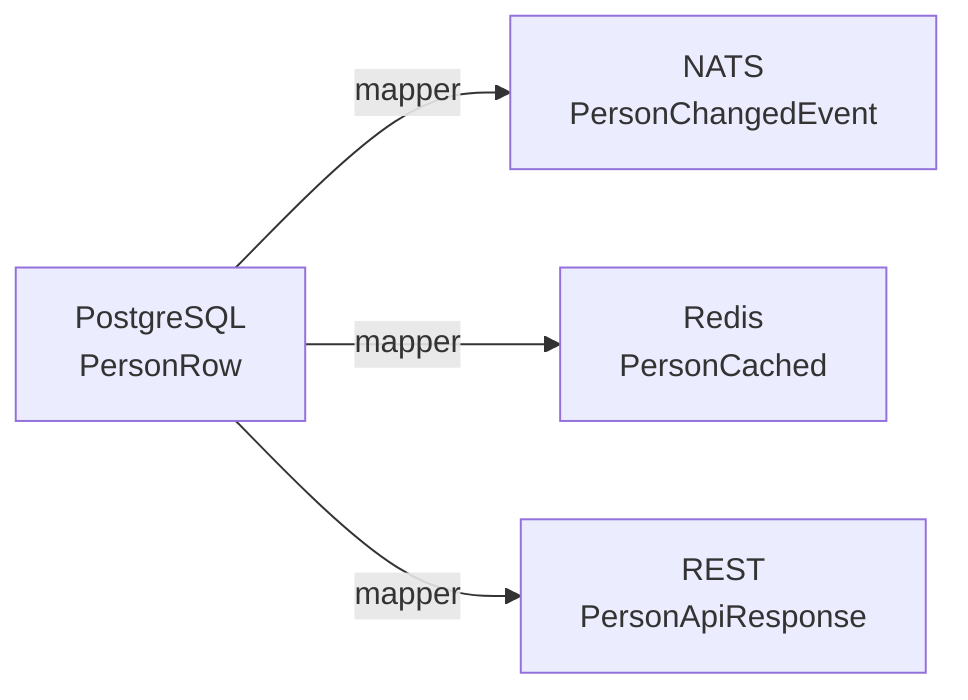
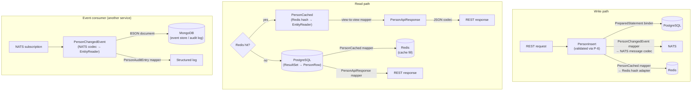

# Typed Annotation Exposure in Generated Boilerplate

## Problem

The string+map approach (`FieldAnnotation(String, Map<String,Object>)`) loses type safety the moment a consumer reads an attribute. Callers must cast values, use string keys, and have no compile-time guarantees about attribute presence or type.

This document evaluates four progressively stronger typing options, all compatible with the existing property enum pattern.

---

## Option 1 — Typed descriptor records per annotation kind

Generate a dedicated record for each annotation type the project cares about:

```java
// In hipster-entity-api — hand-written, one per annotation kind
public record FieldSourceMeta(FieldKind kind, String column, String relation, String expression) {}
public record NotNullMeta(String message) {}
public record SizeMeta(int min, int max) {}
```

The property enum exposes them via typed nullable getters:

```java
public enum PersonSummaryProperty {
    id(Long.class, null, null, null),
    firstName(String.class, null, new NotNullMeta("must not be null"), new SizeMeta(1, 100)),
    age(Integer.class,
        new FieldSourceMeta(FieldKind.DERIVED, null, null, "YEAR(NOW()) - YEAR(birthDate)"),
        null, null);

    private final Type propertyType;
    private final FieldSourceMeta fieldSource;
    private final NotNullMeta notNull;
    private final SizeMeta size;

    // constructor, getters...
    public FieldSourceMeta fieldSource() { return fieldSource; }
    public NotNullMeta notNull() { return notNull; }
    public SizeMeta size() { return size; }
}
```

**Pros**: Fully typed at the call site — `prop.size().min()` returns `int`, not `Object`. No casts, no string keys.

**Cons**: Enum constructor grows per supported annotation. Adding a new annotation kind requires a new record + a new constructor parameter on every property enum. Works well for a **known, bounded set** of annotations.

---

## Option 2 — Class-keyed typed lookup (mirrors `AnnotatedElement.getAnnotation(Class)`)

Define a generic container that maps annotation meta-record class → instance:

```java
// In hipster-entity-api
public final class AnnotationMap {
    private final Map<Class<?>, Object> map;

    private AnnotationMap(Map<Class<?>, Object> map) { this.map = Map.copyOf(map); }

    public static AnnotationMap of(Object... keysAndValues) {
        Map<Class<?>, Object> map = new LinkedHashMap<>();
        for (int i = 0; i < keysAndValues.length; i += 2) {
            map.put((Class<?>) keysAndValues[i], keysAndValues[i + 1]);
        }
        return new AnnotationMap(map);
    }

    @SuppressWarnings("unchecked")
    public <A> A get(Class<A> type) { return (A) map.get(type); }

    public boolean has(Class<?> type) { return map.containsKey(type); }
}
```

Usage in the enum:

```java
public enum PersonSummaryProperty {
    firstName(String.class, AnnotationMap.of(
        NotNullMeta.class, new NotNullMeta("must not be null"),
        SizeMeta.class, new SizeMeta(1, 100)
    )),
    age(Integer.class, AnnotationMap.of(
        FieldSourceMeta.class, new FieldSourceMeta(FieldKind.DERIVED, null, null, "YEAR(NOW()) - YEAR(birthDate)")
    ));

    private final Type propertyType;
    private final AnnotationMap annotations;

    // ...
    public AnnotationMap annotations() { return annotations; }
}
```

Consumer code:

```java
SizeMeta size = prop.annotations().get(SizeMeta.class);  // typed, nullable
if (size != null) {
    validate(value, size.min(), size.max());
}
```

**Pros**: Enum constructor stays stable (always 2 params). Adding new annotation kinds only requires a new record — no enum signature change. Lookup is typed via class literal key.

**Cons**: One unchecked cast inside `AnnotationMap.get()` (safe by construction). Slightly less discoverable than direct getter methods.

---

## Option 3 — Generated annotation interface implementations

Generate anonymous implementations of the actual Java annotation interfaces:

```java
// Generated constant
public static final FieldSource AGE_FIELD_SOURCE = new FieldSource() {
    @Override public FieldKind kind() { return FieldKind.DERIVED; }
    @Override public String column() { return ""; }
    @Override public String relation() { return ""; }
    @Override public String expression() { return "YEAR(NOW()) - YEAR(birthDate)"; }
    @Override public Class<? extends Annotation> annotationType() { return FieldSource.class; }
};
```

Exposed on the enum via the `AnnotationMap` from Option 2, or via direct typed getter:

```java
// Consumer code — works with any framework that accepts annotation instances
FieldSource fs = prop.annotations().get(FieldSource.class);
validator.validate(value, prop.annotations().get(NotNull.class));
```

**Pros**: Works directly with code expecting real annotation instances (Bean Validation, Jackson introspection, Spring conditional logic). Full type safety — the annotation interface *is* the type contract.

**Cons**: Only works for annotations whose classes are on the classpath (fine for project-owned and Jakarta/javax annotations). Requires implementing `equals`/`hashCode`/`toString` per annotation spec (JLS §9.6.1) if framework code compares annotation instances. More generated code per annotation.

---

## Option 4 — Sealed interface hierarchy with pattern matching

Define a sealed annotation meta hierarchy so consumers can `switch` exhaustively:

```java
// In hipster-entity-api
public sealed interface FieldMeta permits FieldSourceMeta, NotNullMeta, SizeMeta, PatternMeta {}

public record FieldSourceMeta(FieldKind kind, String column, String relation, String expression)
        implements FieldMeta {}
public record NotNullMeta(String message) implements FieldMeta {}
public record SizeMeta(int min, int max) implements FieldMeta {}
public record PatternMeta(String regexp) implements FieldMeta {}
```

The enum carries `List<FieldMeta>`:

```java
public enum PersonSummaryProperty {
    firstName(String.class, List.of(
        new NotNullMeta("must not be null"),
        new SizeMeta(1, 100)
    )),
    age(Integer.class, List.of(
        new FieldSourceMeta(FieldKind.DERIVED, null, null, "YEAR(NOW()) - YEAR(birthDate)")
    ));

    private final Type propertyType;
    private final List<FieldMeta> fieldMetas;
    // ...
}
```

Consumer code with Java 21 pattern matching:

```java
for (FieldMeta meta : prop.fieldMetas()) {
    switch (meta) {
        case SizeMeta s -> validate(value, s.min(), s.max());
        case NotNullMeta n -> requireNonNull(value, n.message());
        case FieldSourceMeta fs -> /* query planning */ ;
        case PatternMeta p -> matchRegex(value, p.regexp());
    }
}
```

**Pros**: Exhaustive switch — compiler warns if a new `FieldMeta` variant is added but not handled. Clean Java 21 idiom. Strongly typed. No casts, no string keys.

**Cons**: Sealed hierarchy must be defined up-front in the API module. Third-party annotation kinds need a new record + a `permits` update (or a fallback `GenericAnnotationMeta` record for unrecognized annotations).

---

## Comparison

| Aspect | Option 1: Direct getters | Option 2: Class-keyed map | Option 3: Real annotation impls | Option 4: Sealed hierarchy |
|--------|-----|------|------|------|
| Type safety at call site | Full | Full (via class key) | Full | Full (pattern match) |
| Enum constructor stability | Fragile (grows per annotation) | Stable (2 params) | Stable (2 params) | Stable (2 params) |
| Adding new annotation kind | New param everywhere | New record only | New impl only | New record + permits |
| Works with validation frameworks | No (custom records) | Possible with Option 3 hybrid | Yes | No (custom records) |
| Discoverability (IDE autocomplete) | Best (direct methods) | Good (`get(X.class)`) | Good (`get(X.class)`) | Good (sealed switch) |
| Java 21 pattern matching | N/A | N/A | N/A | Best |
| Extensible to unknown annotations | No | Yes (add `GenericMeta`) | Yes (if class available) | Partial (needs fallback case) |

---

## Recommendation

**Option 2 + Option 4 hybrid** — use `AnnotationMap` as the lookup container (stable constructor, class-keyed lookup), with the values being records from a sealed `FieldMeta` hierarchy (exhaustive switching, pattern matching). For annotations that must interop with Bean Validation or Jackson, layer Option 3 implementations behind the same `AnnotationMap.get(Class)` API — the container doesn't care if the value is a record or an annotation instance.

```java
// Hybrid: class-keyed lookup + sealed types + real annotation instances where needed
SizeMeta size = prop.annotations().get(SizeMeta.class);        // typed record
FieldSource fs = prop.annotations().get(FieldSource.class);     // real annotation impl
```

This combination delivers:
- **Stable enum constructor** — always `(Type, AnnotationMap)`
- **Typed record lookup** — `get(SizeMeta.class)` returns `SizeMeta` with no cast at the call site
- **Exhaustive switch** — `for (FieldMeta m : ...) switch (m) { ... }` with compiler enforcement
- **Framework interop** — real annotation instances stored alongside records in the same map
- **Open extension** — new records and annotation impls added without changing enum signatures

---

## Registration: declaring which annotations to collect as typed records

The generator needs to know **which** source annotations map to **which** meta records so it can produce typed `AnnotationMap` entries instead of raw string/map data. There are several ways to declare this mapping.

### Approach A — `@CollectAnnotation` marker on the meta record

The meta record declares itself as collectible with a simple marker annotation. The **annotation it mirrors is derived from the record name** — strip the `Meta` suffix to get the annotation simple name (`SizeMeta` → `@Size`, `NotNullMeta` → `@NotNull`, `FieldSourceMeta` → `@FieldSource`). Record component names must match annotation attribute names.

```java
// In hipster-entity-api
@Retention(RetentionPolicy.RUNTIME)
@Target(ElementType.TYPE)
public @interface CollectAnnotation {
    /** Override annotation simple name when convention (strip "Meta") does not apply. */
    String value() default "";
}
```

Applied to each meta record — no parameter needed in the common case:

```java
@CollectAnnotation
public record NotNullMeta(String message) implements FieldMeta {}
// → collects @NotNull (derived from record name: "NotNullMeta" → "NotNull")

@CollectAnnotation
public record SizeMeta(int min, int max) implements FieldMeta {}
// → collects @Size

@CollectAnnotation
public record FieldSourceMeta(FieldKind kind, String column, String relation, String expression)
        implements FieldMeta {}
// → collects @FieldSource

// Override for non-obvious mapping:
@CollectAnnotation("Length")
public record LengthMeta(int min, int max) implements FieldMeta {}
// → collects @Length (org.hibernate.validator.constraints.Length)
```

**How the generator uses it**: At startup, the generator scans the classpath (or a configured source root) for records annotated with `@CollectAnnotation`. For each one:

1. If `value()` is non-empty → use it as the annotation simple name.
2. Otherwise → strip `Meta` suffix from the record name.
3. Extract record component names → these are the expected annotation attributes.

This builds the mapping:

```
NotNullMeta      → @NotNull    (message)
SizeMeta         → @Size       (min, max)
FieldSourceMeta  → @FieldSource(kind, column, relation, expression)
LengthMeta       → @Length     (min, max)  — explicit override
```

When parsing a method and encountering `@Size(min = 1, max = 100)`, the generator knows to emit `new SizeMeta(1, 100)` in the property enum.

**Attribute mapping convention**: Record component names must match annotation attribute names. The generator matches by name and coerces types (string literals → `String`, integer literals → `int`, enum references → enum constant names or values). Unmatched annotation attributes get their default values; unmatched record components get `null`/`0`/`false`.

**Pros**: Self-documenting — the record name *is* the annotation name. No redundant parameter in the common case. Override available when naming convention doesn't apply. No compile-time dependency on the annotation class itself.

---

### Approach B — SPI / ServiceLoader registration

Define an SPI interface for annotation-to-record mappings:

```java
// In hipster-entity-api
public interface AnnotationRecordMapping {
    /** Simple or qualified annotation name to match in source. */
    String annotationName();

    /** The meta record class to instantiate. */
    Class<? extends FieldMeta> recordType();

    /** Ordered record component names — must match annotation attributes. */
    List<String> componentNames();
}
```

Implementations are registered via `META-INF/services`:

```
# META-INF/services/hr.hrg.hipster.entity.api.AnnotationRecordMapping
com.example.mappings.SizeMapping
com.example.mappings.NotNullMapping
```

```java
public class SizeMapping implements AnnotationRecordMapping {
    public String annotationName() { return "jakarta.validation.constraints.Size"; }
    public Class<? extends FieldMeta> recordType() { return SizeMeta.class; }
    public List<String> componentNames() { return List.of("min", "max"); }
}
```

**Pros**: Fully decoupled — annotation mappings can live in separate modules. Third parties can add their own mappings without touching the API module.

**Cons**: More ceremony. Hard to discover without documentation. Requires runtime classpath scanning.

---

### Approach C — Convention-based auto-discovery (zero config)

Variant of Approach A without even requiring the `@CollectAnnotation` marker. The generator discovers meta records purely by convention:

1. Scan for records implementing `FieldMeta` (or another marker interface).
2. For each record, derive the annotation name from the record name: `SizeMeta` → look for `@Size`; `NotNullMeta` → look for `@NotNull`; `FieldSourceMeta` → look for `@FieldSource`.
3. Match record component names to annotation attribute names by exact name match.

```java
// No annotation needed — convention does the work
public record SizeMeta(int min, int max) implements FieldMeta {}
// Generator sees "SizeMeta" → strips "Meta" → looks for @Size on methods
// Matches components: min→@Size.min(), max→@Size.max()
```

**Pros**: Zero configuration. Adding a new record is all that's required. Naming convention is intuitive.

**Cons**: Every `FieldMeta` record is automatically collected — no opt-out. If a record exists in the hierarchy for internal use but should not trigger annotation scanning, it will still be picked up.

---

### Recommended approach: Approach A

`@CollectAnnotation` is the best balance of explicitness and convenience:

- **Record name = annotation name** — no redundant parameter, no separate config.
- **Optional `value()` override** — handles edge cases like `@CollectAnnotation("Length")` on `LengthMeta`.
- **Opt-in** — only records explicitly marked with `@CollectAnnotation` are collected. Internal `FieldMeta` records without the marker are ignored.
- **Component-name matching** — record component names always map to annotation attribute names by exact match.

```java
// Common case: no parameter needed
@CollectAnnotation
public record SizeMeta(int min, int max) implements FieldMeta {}

// Override: non-obvious mapping
@CollectAnnotation("Length")
public record LengthMeta(int min, int max) implements FieldMeta {}

// Project-owned: convention works directly
@CollectAnnotation
public record FieldSourceMeta(FieldKind kind, String column, String relation, String expression)
        implements FieldMeta {}
```

### Generator flow

```
1. Scan source/classpath for records implementing FieldMeta
2. For each record:
   a. Read @CollectAnnotation — if value() is non-empty, use it as annotation simple name
   b. Else → strip "Meta" suffix from record name → use as annotation simple name
   c. Extract record component names → these are the expected annotation attributes
3. Build mapping: annotationName → (recordClass, componentNames[])
4. While parsing method annotations:
   a. For each annotation on a method, look up by simple name in the mapping
   b. If found → extract attribute values from the annotation expression
   c. Match attribute values to record components by name
   d. Emit: new XyzMeta(attr1, attr2, ...) in generated code
   e. If not found → skip (or emit GenericAnnotationMeta if catch-all is enabled)
```

### Attribute type coercion

The generator must coerce JavaParser annotation expression values to record component types:

| Annotation value | Record component type | Coercion |
|-----------------|----------------------|----------|
| String literal `"abc"` | `String` | Direct |
| Integer literal `42` | `int` / `Integer` | Direct |
| Long literal `42L` | `long` / `Long` | Direct |
| Boolean literal `true` | `boolean` / `Boolean` | Direct |
| Enum reference `FieldKind.DERIVED` | `FieldKind` (enum) | Resolve enum constant |
| Class literal `String.class` | `Class<?>` | Store as `String` (class name) or `Class` if on classpath |
| Array `{"a", "b"}` | `String[]` / `List<String>` | Collect elements |
| Nested annotation `@Inner(...)` | Nested record | Recursive mapping |
| Absent (default) | Any | Use annotation default or `null`/`0`/`false` |

### Example: end-to-end

Source interface:

```java
public interface PersonSummary extends PersonEntity {
    @NotNull
    @Size(min = 1, max = 100)
    String firstName();

    @FieldSource(kind = FieldKind.DERIVED, expression = "YEAR(NOW()) - YEAR(birthDate)")
    Integer age();
}
```

Registered meta records:

```java
@CollectAnnotation
public record NotNullMeta(String message) implements FieldMeta {}       // → collects @NotNull
@CollectAnnotation
public record SizeMeta(int min, int max) implements FieldMeta {}        // → collects @Size
@CollectAnnotation
public record FieldSourceMeta(FieldKind kind, String column,
    String relation, String expression) implements FieldMeta {}         // → collects @FieldSource
```

Generated property enum:

```java
public enum PersonSummaryProperty {
    id(Long.class, AnnotationMap.of()),
    firstName(String.class, AnnotationMap.of(
        NotNullMeta.class, new NotNullMeta(null),
        SizeMeta.class, new SizeMeta(1, 100)
    )),
    age(Integer.class, AnnotationMap.of(
        FieldSourceMeta.class, new FieldSourceMeta(
            FieldKind.DERIVED, null, null, "YEAR(NOW()) - YEAR(birthDate)")
    ));

    // ...
}
```

---

## Collected annotations registry

The list of all `@CollectAnnotation`-marked records and their structure should be visible both at Java runtime (for tooling, validation, introspection) and in JSON output (for HTML-based project explorers, documentation generators, schema visualizers).

### Java API: generated `CollectedAnnotations` class

The generator produces a **single global class** (not per-entity) that exposes every registered annotation meta record with its structure. Since the set of `@CollectAnnotation`-marked records is project-wide and independent of any specific entity, the registry is generated once in a shared package:

```java
// Generated once — e.g. in the project's base package or a dedicated metadata package
public final class CollectedAnnotations {

    public record AnnotationDescriptor(
        String annotationName,          // "NotNull", "Size", "FieldSource"
        Class<? extends FieldMeta> metaType,  // NotNullMeta.class, SizeMeta.class
        List<ComponentDescriptor> components   // record component metadata
    ) {}

    public record ComponentDescriptor(
        String name,                    // "min", "max", "kind"
        Class<?> type                   // int.class, String.class, FieldKind.class
    ) {}

    private static final List<AnnotationDescriptor> ALL = List.of(
        new AnnotationDescriptor("NotNull", NotNullMeta.class, List.of(
            new ComponentDescriptor("message", String.class)
        )),
        new AnnotationDescriptor("Size", SizeMeta.class, List.of(
            new ComponentDescriptor("min", int.class),
            new ComponentDescriptor("max", int.class)
        )),
        new AnnotationDescriptor("FieldSource", FieldSourceMeta.class, List.of(
            new ComponentDescriptor("kind", FieldKind.class),
            new ComponentDescriptor("column", String.class),
            new ComponentDescriptor("relation", String.class),
            new ComponentDescriptor("expression", String.class)
        ))
    );

    /** All annotation types the generator collects for this entity. */
    public static List<AnnotationDescriptor> all() { return ALL; }

    /** Look up descriptor by annotation simple name. */
    public static AnnotationDescriptor byName(String annotationName) {
        return ALL.stream()
            .filter(d -> d.annotationName().equals(annotationName))
            .findFirst().orElse(null);
    }

    /** Look up descriptor by meta record class. */
    public static AnnotationDescriptor byType(Class<? extends FieldMeta> metaType) {
        return ALL.stream()
            .filter(d -> d.metaType().equals(metaType))
            .findFirst().orElse(null);
    }
}
```

**Usage by tooling**:

```java
// List all collected annotation types
for (var desc : CollectedAnnotations.all()) {
    System.out.println("@" + desc.annotationName() + " → " + desc.metaType().getSimpleName());
    for (var comp : desc.components()) {
        System.out.println("  " + comp.name() + ": " + comp.type().getSimpleName());
    }
}

// Check if a specific annotation is in the registry
if (CollectedAnnotations.byName("Size") != null) {
    // annotation schema is known — can build dynamic UI controls
}

// Cross-reference: find all fields across all views that carry @NotNull
var notNullDesc = CollectedAnnotations.byType(NotNullMeta.class);
for (PersonSummaryProperty prop : PersonSummaryProperty.values()) {
    if (prop.annotations().has(NotNullMeta.class)) {
        // this field has @NotNull
    }
}
```

### JSON output: `collected-annotations.json`

The generator produces a **single** `collected-annotations.json` file alongside the per-entity metadata files. This is not embedded in each entity's JSON — it's a global registry that HTML tooling loads once.

```json
{
  "collectedAnnotations": [
    {
      "annotationName": "NotNull",
      "metaRecord": "NotNullMeta",
      "components": [
        { "name": "message", "type": "java.lang.String" }
      ]
    },
    {
      "annotationName": "Size",
      "metaRecord": "SizeMeta",
      "components": [
        { "name": "min", "type": "int" },
        { "name": "max", "type": "int" }
      ]
    },
    {
      "annotationName": "FieldSource",
      "metaRecord": "FieldSourceMeta",
      "components": [
        { "name": "kind", "type": "hr.hrg.hipster.entity.api.FieldKind" },
        { "name": "column", "type": "java.lang.String" },
        { "name": "relation", "type": "java.lang.String" },
        { "name": "expression", "type": "java.lang.String" }
      ]
    }
  ]
}
```

Per-entity `X.metadata.json` files carry annotation values directly on each property — they do not reference or duplicate the global registry.

### Per-property annotations in JSON

Each property carries its annotations inline with full attribute values. No reference to the global registry is needed — the per-property data is self-contained:

```json
{
  "name": "firstName",
  "type": "java.lang.String",
  "annotations": [
    {
      "annotationName": "NotNull",
      "values": { "message": null }
    },
    {
      "annotationName": "Size",
      "values": { "min": 1, "max": 100 }
    }
  ]
}
```

HTML tooling that needs to know the *type* of each attribute value (e.g. to render number inputs for `int`, dropdowns for enums) can optionally load `collected-annotations.json` for the component schema. But the per-entity JSON is usable on its own — attribute values are JSON-typed (numbers, strings, booleans, nulls) and self-describing.

### What this enables for HTML-based tooling

| Use case | How JSON registry helps |
|----------|----------------------|
| Entity structure explorer | Render entity → views → fields tree with annotation badges |
| Dynamic form builder | Use `collectedAnnotations` component types to generate input controls for annotation values |
| Validation rule viewer | List all `@NotNull`, `@Size`, `@Pattern` constraints per field across all views |
| Schema documentation | Auto-generate per-field documentation tables with constraint details |
| Field comparison | Show annotation differences between views for the same field (typeByView + annotations) |
| Project-wide annotation usage report | Aggregate which annotations are used on which fields across all entities |

### Generator implementation notes

`CollectedAnnotations` is a **single global file** — generated once per project, not per entity. The annotation registry is entity-independent because the `@CollectAnnotation`-marked records are project-wide.

- **Java class**: Generated into the module's output package declared by `@HipsterEntityModule` (see [Module descriptor](#module-descriptor) below). Each module gets its own isolated `CollectedAnnotations` — no conflicts when multiple modules share a classpath.
- **JSON**: Generated as a single `collected-annotations.json` file alongside the per-entity metadata files. Entity metadata does not reference or embed the registry — the two outputs are independent. HTML tooling loads the registry only if it needs component type information beyond what JSON values already provide.

---

## Module descriptor

### Problem

Global per-module outputs like `CollectedAnnotations` need a home package, and the generator needs to know which source roots to scan for entity interfaces. A hard-coded base package (e.g. `hr.hrg.hipster.entity`) causes class-name collisions when multiple projects are combined on the same classpath — every project would generate `CollectedAnnotations` in the same package. We need a per-module declaration that:

1. Anchors a **base package** for generated module-scoped outputs.
2. Declares **scan packages** — where to discover entity interfaces.
3. Is discoverable at **compile time** (for the JavaParser-based generator) and at **runtime** (for frameworks and tooling).
4. **Combines** across jars — when multiple modules are on the classpath, each contributes its own descriptor without conflicts.

### Design: `@HipsterEntityModule` annotation + generated metadata class

Each module defines a single hand-written class annotated with `@HipsterEntityModule`. This class is both a classpath anchor and a configuration carrier. The generator then produces a **generated metadata class** in the same package that implements a common `EntityModuleMeta` interface — discoverable at runtime via `ServiceLoader`, no JSON parsing required.

#### Annotation definition

```java
// In hipster-entity-api
@Retention(RetentionPolicy.RUNTIME)
@Target(ElementType.TYPE)
public @interface HipsterEntityModule {
    /**
     * Packages to scan for entity interfaces (interfaces extending EntityBase).
     * Defaults to the annotated class's package and its sub-packages.
     */
    String[] scanPackages() default {};

    /**
     * Base package for generated module-scoped output (property enums,
     * CollectedAnnotations, etc.). Defaults to the annotated class's package.
     */
    String outputPackage() default "";
}
```

#### `EntityModuleMeta` interface (in hipster-entity-api)

```java
// In hipster-entity-api — the contract generated classes implement
public interface EntityModuleMeta {
    /** The hand-written @HipsterEntityModule class. */
    Class<?> moduleClass();

    /** Base package for generated module-scoped outputs. */
    String outputPackage();

    /** Packages that were scanned for entity interfaces. */
    List<String> scanPackages();

    /** All entity marker interfaces discovered in this module. */
    List<Class<? extends EntityBase<?>>> entities();

    /** The generated CollectedAnnotations class for this module, or null. */
    Class<?> collectedAnnotationsClass();
}
```

#### Module class (hand-written, one per module)

```java
package com.example.myapp.entity;

import hr.hrg.hipster.entity.api.HipsterEntityModule;

@HipsterEntityModule(
    scanPackages = {
        "com.example.myapp.entity.person",
        "com.example.myapp.entity.order"
    }
    // outputPackage defaults to "com.example.myapp.entity" (this class's package)
)
public final class MyAppEntityModule {
    private MyAppEntityModule() {}
}
```

When `scanPackages` is empty, the generator scans the annotated class's package and all sub-packages. When `outputPackage` is empty, it defaults to the annotated class's package — the module class's location *is* the convention.

A second module in the same project or a different jar:

```java
package com.example.billing.entity;

@HipsterEntityModule  // scans com.example.billing.entity.**, output to same package
public final class BillingEntityModule {
    private BillingEntityModule() {}
}
```

Both produce their own generated metadata class in their own package — no collision.

#### What the generator produces per module

Given `MyAppEntityModule` above, the generator emits:

| Output | Location |
|--------|----------|
| Property enums | `com.example.myapp.entity.person.PersonSummaryProperty`, etc. (entity's own package) |
| `CollectedAnnotations` | `com.example.myapp.entity.CollectedAnnotations` (module output package) |
| `MyAppEntityModule_Meta` | `com.example.myapp.entity.MyAppEntityModule_Meta` (generated, implements `EntityModuleMeta`) |
| `META-INF/services/...EntityModuleMeta` | ServiceLoader registration for `MyAppEntityModule_Meta` |
| `collected-annotations.json` | alongside entity metadata files (for HTML tooling) |

#### Generated metadata class

The generator produces a concrete class that implements `EntityModuleMeta`. This is pure generated Java — loaded by the classloader like any other class, no JSON parsing involved:

```java
// Generated — com.example.myapp.entity.MyAppEntityModule_Meta
package com.example.myapp.entity;

import hr.hrg.hipster.entity.api.EntityBase;
import hr.hrg.hipster.entity.api.EntityModuleMeta;
import com.example.myapp.entity.person.PersonEntity;
import com.example.myapp.entity.order.OrderEntity;
import java.util.List;

public final class MyAppEntityModule_Meta implements EntityModuleMeta {

    @Override public Class<?> moduleClass() {
        return MyAppEntityModule.class;
    }

    @Override public String outputPackage() {
        return "com.example.myapp.entity";
    }

    @Override public List<String> scanPackages() {
        return List.of(
            "com.example.myapp.entity.person",
            "com.example.myapp.entity.order"
        );
    }

    @Override public List<Class<? extends EntityBase<?>>> entities() {
        return List.of(PersonEntity.class, OrderEntity.class);
    }

    @Override public Class<?> collectedAnnotationsClass() {
        return CollectedAnnotations.class;
    }
}
```

Everything is compiled Java — class literals, typed lists, direct references. The classloader does all the work.

#### Discovery via ServiceLoader

ServiceLoader is used at **two stages** — not just runtime. The hand-written module class registers itself via `META-INF/services/` so that development-time tooling (code generators, validators, IDE plugins) can discover modules **before** any code is generated. After generation, the generated `_Meta` class provides richer metadata for runtime use.

##### 1. Compile-time / tooling discovery: the module class itself

The hand-written `@HipsterEntityModule` class implements a **marker interface** so that development tooling can discover it via `ServiceLoader` at compile time — before any generated code exists:

```java
// In hipster-entity-api — marker for ServiceLoader discovery
public interface HipsterEntityModuleDescriptor {
    /** The @HipsterEntityModule annotation on this class carries the configuration. */
}
```

The module class implements it:

```java
@HipsterEntityModule(
    scanPackages = "com.example.myapp.entity.person"
)
public final class MyAppEntityModule implements HipsterEntityModuleDescriptor {
    private MyAppEntityModule() {}
}
```

With a hand-written `META-INF/services/` entry (shipped with the module's source jar):

```
# META-INF/services/hr.hrg.hipster.entity.api.HipsterEntityModuleDescriptor
com.example.myapp.entity.MyAppEntityModule
```

Tooling uses this to bootstrap:

```java
// In the code generator or validation tool
ServiceLoader.load(HipsterEntityModuleDescriptor.class).forEach(descriptor -> {
    HipsterEntityModule ann = descriptor.getClass().getAnnotation(HipsterEntityModule.class);
    String[] scanPkgs = ann.scanPackages();
    String outputPkg = ann.outputPackage().isEmpty()
        ? descriptor.getClass().getPackageName()
        : ann.outputPackage();
    // now scan, generate, validate...
});
```

This is what drives code generation and validation during development — the tooling discovers which modules exist and what packages to scan **without** needing the generated `_Meta` class to already exist.

##### 2. Runtime discovery: the generated `_Meta` class

After generation, the `_Meta` class provides richer metadata (entity list, collected annotations class) for runtime frameworks:

The generator emits a `META-INF/services/hr.hrg.hipster.entity.api.EntityModuleMeta` file (one line per module class per jar). ServiceLoader merges these across jars automatically:

```
# META-INF/services/hr.hrg.hipster.entity.api.EntityModuleMeta
com.example.myapp.entity.MyAppEntityModule_Meta
```

Discovery at runtime:

```java
// In hipster-entity-api or hipster-entity-core
public final class HipsterEntityModules {

    /** Discover all hipster-entity modules on the classpath. */
    public static List<EntityModuleMeta> discover() {
        return ServiceLoader.load(EntityModuleMeta.class)
            .stream()
            .map(ServiceLoader.Provider::get)
            .toList();
    }
}
```

No JSON parsing, no resource scanning, no string-based lookups. `ServiceLoader` handles multi-jar merging natively. Each module's `_Meta` class is loaded by the classloader and returns typed class literals and lists.

##### Summary: two ServiceLoader registrations per module

| Registration | Interface | Class | Who writes it | When available |
|-------------|-----------|-------|---------------|----------------|
| `META-INF/services/HipsterEntityModuleDescriptor` | `HipsterEntityModuleDescriptor` | `MyAppEntityModule` (hand-written) | Developer | From the start — drives code gen and validation |
| `META-INF/services/EntityModuleMeta` | `EntityModuleMeta` | `MyAppEntityModule_Meta` (generated) | Generator | After code gen — drives runtime frameworks |

### Compile-time flow

```
1. Generator scans source roots for classes annotated with @HipsterEntityModule
2. For each module:
   a. Read scanPackages (or default to module class's package tree)
   b. Read outputPackage (or default to module class's package)
   c. Scan declared packages for interfaces extending EntityBase
   d. Process entities → generate property enums in each entity's package
   e. Collect @CollectAnnotation records → generate CollectedAnnotations in outputPackage
   f. Generate <ModuleClass>_Meta implementing EntityModuleMeta in outputPackage
   g. Append <ModuleClass>_Meta FQCN to META-INF/services/EntityModuleMeta
   h. Emit collected-annotations.json alongside entity metadata (for HTML tooling)
```

### Multi-module classpath: no conflicts

| Module jar | Module class | Output package | `CollectedAnnotations` FQCN | Generated `_Meta` class |
|------------|-------------|----------------|------------------------------|--------------------------|
| myapp-entities.jar | `c.e.myapp.entity.MyAppEntityModule` | `c.e.myapp.entity` | `c.e.myapp.entity.CollectedAnnotations` | `c.e.myapp.entity.MyAppEntityModule_Meta` |
| billing-entities.jar | `c.e.billing.entity.BillingEntityModule` | `c.e.billing.entity` | `c.e.billing.entity.CollectedAnnotations` | `c.e.billing.entity.BillingEntityModule_Meta` |
| hr-entities.jar | `c.e.hr.entity.HrEntityModule` | `c.e.hr.entity` | `c.e.hr.entity.CollectedAnnotations` | `c.e.hr.entity.HrEntityModule_Meta` |

Each jar contributes its own `_Meta` class and `META-INF/services/` entry. `ServiceLoader` merges them at runtime. No class-name or package conflicts.

### Extensible settings

The `@HipsterEntityModule` annotation can be extended with additional settings as needs arise:

```java
@HipsterEntityModule(
    scanPackages = "com.example.myapp.entity.person",
    outputPackage = "com.example.myapp.entity"
    // future: outputFormat = OutputFormat.JAVA_AND_JSON,
    // future: generateBuilders = true,
    // future: generateMappers = true
)
public final class MyAppEntityModule {}
```

New attributes with defaults keep existing module classes forward-compatible.

### Relationship to existing `CoreModuleMarker`

The existing `CoreModuleMarker` class in `hipster-entity-core` is an ad-hoc version of this pattern. Once `@HipsterEntityModule` is implemented, `CoreModuleMarker` can be replaced with:

```java
@HipsterEntityModule
public final class HipsterEntityCoreModule {
    private HipsterEntityCoreModule() {}
}
```

---

## Multi-store and multi-channel usage

### The problem

In real projects, the same entity often touches multiple infrastructure systems:

- **PostgreSQL** — primary relational store (COLUMN fields, joins, expressions)
- **MongoDB** — document store (embedded sub-documents, denormalized views)
- **NATS / Kafka / RabbitMQ** — event publishing (lightweight payloads, change deltas)
- **Redis / Memcached** — cache layer (serialized read views)
- **Logging / audit** — structured log entries (subset of fields, timestamps)
- **gRPC / REST API** — external contract (DTOs, versioned schemas)

A `PersonEntity` might be written to PostgreSQL, published to NATS on change, cached in Redis for fast reads, and served over REST — each concern wants a different **view** of the same entity, potentially with different field subsets, types, or annotations.

### Approach: views as infrastructure projections

The existing view system already solves this — **views are not just read/write variants, they are infrastructure projections**. Each store or channel gets its own view interface tailored to what it needs:

```java
// ─── Core entity ───
public interface PersonEntity extends EntityBase<Long> {}

// ─── PostgreSQL views ───
public interface PersonRow extends PersonEntity {
    String firstName();
    String lastName();
    @FieldSource(kind = FieldKind.DERIVED, expression = "YEAR(NOW()) - YEAR(birthDate)")
    Integer age();
    @FieldSource(kind = FieldKind.JOINED, relation = "department.name")
    String departmentName();
}

@View(write = BooleanOption.TRUE, read = BooleanOption.FALSE)
public interface PersonInsert extends PersonEntity {
    String firstName();
    String lastName();
    Instant birthDate();
    Long departmentId();
}

// ─── NATS event payload ───
@View(read = BooleanOption.TRUE, write = BooleanOption.FALSE)
public interface PersonChangedEvent extends PersonEntity {
    String firstName();
    String lastName();
    Instant updatedAt();
    // lightweight — no DERIVED or JOINED fields
}

// ─── Redis cache view ───
@View(read = BooleanOption.TRUE, write = BooleanOption.TRUE)
public interface PersonCached extends PersonEntity {
    String firstName();
    String lastName();
    Integer age();
    String departmentName();
    // denormalized — all fields pre-resolved, no joins at read time
}

// ─── Logging / audit view ───
@View(read = BooleanOption.TRUE, write = BooleanOption.FALSE)
public interface PersonAuditEntry extends PersonEntity {
    String firstName();
    String lastName();
    Instant createdAt();
    Instant updatedAt();
    String changedBy();
}

// ─── REST API DTO ───
@View(read = BooleanOption.TRUE, write = BooleanOption.FALSE)
public interface PersonApiResponse extends PersonEntity {
    String firstName();
    String lastName();
    Integer age();
    String departmentName();
    Map<String, List<Long>> metadata();
}
```

All of these are views of the same `PersonEntity`. The generator produces a property enum for each, and the entity-wide `allFields` aggregation tracks which fields appear in which views via `typeByView`.

### Store/channel binding via annotations

To let the generator know which adapter to produce for which view, introduce a `@StoreBinding` annotation:

```java
// In hipster-entity-api
@Retention(RetentionPolicy.RUNTIME)
@Target(ElementType.TYPE)
@Repeatable(StoreBindings.class)
public @interface StoreBinding {
    /** Store/channel kind — drives which adapter generator to invoke. */
    StoreKind value();

    /** Optional qualifier (e.g. datasource name, queue name, cache region). */
    String qualifier() default "";
}

@Retention(RetentionPolicy.RUNTIME)
@Target(ElementType.TYPE)
public @interface StoreBindings {
    StoreBinding[] value();
}

public enum StoreKind {
    POSTGRES,
    MONGODB,
    NATS,
    KAFKA,
    REDIS,
    REST,
    GRPC,
    LOG
}
```

Applied to views:

```java
@StoreBinding(StoreKind.POSTGRES)
public interface PersonRow extends PersonEntity { ... }

@StoreBinding(value = StoreKind.POSTGRES, qualifier = "write")
@View(write = BooleanOption.TRUE, read = BooleanOption.FALSE)
public interface PersonInsert extends PersonEntity { ... }

@StoreBinding(StoreKind.NATS)
public interface PersonChangedEvent extends PersonEntity { ... }

@StoreBinding(StoreKind.REDIS)
public interface PersonCached extends PersonEntity { ... }

@StoreBinding(StoreKind.LOG)
public interface PersonAuditEntry extends PersonEntity { ... }

@StoreBinding(StoreKind.REST)
public interface PersonApiResponse extends PersonEntity { ... }
```

The generator reads `@StoreBinding` and produces the matching adapter:

| `StoreKind` | Generated adapter | From proposal |
|-------------|-------------------|---------------|
| `POSTGRES` | ResultSet reader, PreparedStatement binder, SQL fragments | P-3 |
| `MONGODB` | Document codec (BSON ↔ entity) | P-3 variant |
| `NATS` / `KAFKA` | Message serializer/deserializer | P-4 |
| `REDIS` | Hash adapter, key builder | P-5 |
| `REST` / `GRPC` | DTO mapper (may overlap with P-1 view-to-view mapper) | P-1 |
| `LOG` | Structured log formatter | new, lightweight |

### Cross-cutting fields: shared across stores

When the same field appears in views bound to different stores, the generator can produce **cross-store mappers** — data flows from one view to another as it moves between systems:



These are the same P-1 view-to-view mappers, but the generator knows the direction from `@StoreBinding` — reads flow from the primary store outward to caches/events/APIs:

```java
// Generated: PersonRow → PersonChangedEvent mapper
public final class PersonRowToChangedEventMapper {
    public void map(
            EntityReader<Long, PersonEntity, PersonRowProperty> source,
            EntityUpdate<Long, PersonEntity, PersonChangedEventProperty> target) {
        target.set(PersonChangedEventProperty.firstName, source.get(PersonRowProperty.firstName));
        target.set(PersonChangedEventProperty.lastName, source.get(PersonRowProperty.lastName));
        target.set(PersonChangedEventProperty.updatedAt, source.get(PersonRowProperty.updatedAt));
    }
}
```

### Module organization patterns

#### Pattern A: single module, all views together

All entity views live in one module regardless of their store binding. The module descriptor covers everything:

```
com.example.myapp.entity/
    MyAppEntityModule.java          ← @HipsterEntityModule
    person/
        PersonEntity.java
        PersonRow.java              ← @StoreBinding(POSTGRES)
        PersonInsert.java           ← @StoreBinding(POSTGRES)
        PersonChangedEvent.java     ← @StoreBinding(NATS)
        PersonCached.java           ← @StoreBinding(REDIS)
        PersonApiResponse.java      ← @StoreBinding(REST)
```

**When to use**: Small-to-medium projects. All infrastructure adapters are generated together.

#### Pattern B: core entity module + store-specific modules

The entity interfaces are defined in a shared module. Store-specific views extend them in separate modules:

```
com.example.myapp.entity/             ← shared, no store binding
    MyAppEntityModule.java
    person/
        PersonEntity.java
        PersonColumns.java             ← shared field declarations (reusable)

com.example.myapp.entity.pg/          ← PostgreSQL module
    PgEntityModule.java
    person/
        PersonRow.java                 ← @StoreBinding(POSTGRES), extends PersonColumns
        PersonInsert.java

com.example.myapp.entity.nats/        ← NATS module
    NatsEntityModule.java
    person/
        PersonChangedEvent.java        ← @StoreBinding(NATS), extends PersonEntity

com.example.myapp.entity.cache/       ← Redis module
    CacheEntityModule.java
    person/
        PersonCached.java              ← @StoreBinding(REDIS)
```

**When to use**: Larger projects where store adapters have different dependency trees (e.g., NATS client only needed in the NATS module, PostgreSQL driver only in the PG module). Each module jar carries only the dependencies it needs.

#### Pattern C: hybrid — core + optional store overlays

Core module defines the primary views. Store-specific modules add only the views that diverge from the core:

```
com.example.myapp.entity/
    MyAppEntityModule.java
    person/
        PersonEntity.java
        PersonRow.java                 ← @StoreBinding(POSTGRES) — primary
        PersonInsert.java              ← @StoreBinding(POSTGRES)
        PersonApiResponse.java         ← @StoreBinding(REST)

com.example.myapp.entity.events/       ← event views only
    EventEntityModule.java
    person/
        PersonChangedEvent.java        ← @StoreBinding(NATS)
        PersonDeletedEvent.java        ← @StoreBinding(NATS)
```

**When to use**: Most views live with the entity. Event/cache views are split out because they have a different release cadence or dependency set.

### Example: full data flow through stores

Given a `PersonEntity` used across PostgreSQL, NATS, Redis, and REST:



Every arrow in this diagram is a **generated adapter or mapper** — the developer writes only the entity interfaces and the `@StoreBinding` annotations. The generator, using metadata + store bindings, produces all the infrastructure plumbing.

### What `@StoreBinding` adds to the module metadata

The generated `_Meta` class and `CollectedAnnotations` can expose store bindings:

```java
// Extension to EntityModuleMeta
public interface EntityModuleMeta {
    // ... existing methods ...

    /** Views grouped by store kind. */
    Map<StoreKind, List<Class<?>>> viewsByStore();
}
```

```java
// Generated in MyAppEntityModule_Meta
@Override public Map<StoreKind, List<Class<?>>> viewsByStore() {
    return Map.of(
        StoreKind.POSTGRES, List.of(PersonRow.class, PersonInsert.class),
        StoreKind.NATS, List.of(PersonChangedEvent.class),
        StoreKind.REDIS, List.of(PersonCached.class),
        StoreKind.REST, List.of(PersonApiResponse.class)
    );
}
```

Runtime frameworks can use this to auto-register adapters — e.g., a NATS adapter auto-discovers all `StoreKind.NATS` views and subscribes to the appropriate subjects.

### `StoreKind` extensibility

`StoreKind` is an enum in hipster-entity-api. For project-specific stores not covered by the built-in kinds, use the `qualifier` string as a custom discriminator:

```java
@StoreBinding(value = StoreKind.CUSTOM, qualifier = "elasticsearch")
public interface PersonSearchDocument extends PersonEntity { ... }
```

Or define project-level store kinds via a `String`-based alternative:

```java
// Alternative: string-based store name for full flexibility
public @interface StoreBinding {
    String value();      // "postgres", "nats", "elasticsearch", ...
    String qualifier() default "";
}
```

The enum approach is better when the generator needs to switch on store kind to select an adapter generator. The string approach is better when stores are fully plugin-driven. A hybrid (enum with a `CUSTOM` + qualifier fallback) covers both.
